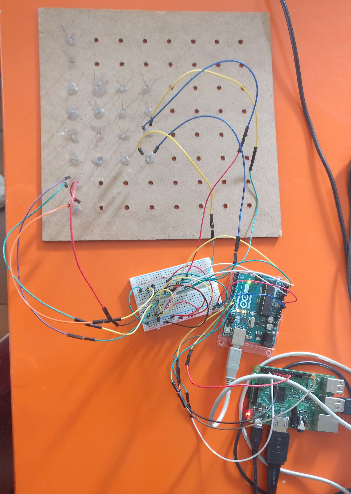

Attention, le code est horrible et pourrais être largement amélioré.

## PSTE 2017-2018

Ce projet était un projet académique: nous devions créer un produit qui repondait à un besoin. Nous avons choisi de créer un échiquier capable de detecter les mouvements des pièces et de les sauvegarder.

## Fonctionnement

Nous avons décidé d'utiliser des photorésistances pour détecter la présence d'une pièce sur chaque case de l'échiquier. À partir des positions initiales des pièces de l'échiquier, nous devrions être capables de suivre le mouvement de chaque pièce sur l'échiquier en observant la résistance sur chaque case.

## Problèmes rencontrés, solutions apportées et leçons apprises

| problème                                                                                                                                                    | solution                                                                                                                                                   | leçon apprise                                                                                                                                                                                                                              |
|-------------------------------------------------------------------------------------------------------------------------------------------------------------|------------------------------------------------------------------------------------------------------------------------------------------------------------|--------------------------------------------------------------------------------------------------------------------------------------------------------------------------------------------------------------------------------------------|
| Dans un début, nous voulions utiliser des interrupteurs REED (interrupteurs qui se ferment lors de la présence d'un aimant) mais ceux-ci étaient trop chers | Nous avons choisi d'utiliser des photorésistances. Notre échiquier serait utilisable que lorsqu'il y a de la lumière, mais c'est quasiment toujours le cas | Il y a toujours des solutions                                                                                                                                                                                                              |
| Achat d'une Raspberry Pi sans prendre en considération le fait qu'elle n'avait pas de convertisseur analogique-numérique                                    | Utilisation d'une Arduino en tant que convertisseur                                                                                                        | Il faut bien regarder les spécifications/data sheet du produit que l'on achète pour bien s'assurer qu'il va répondre à nos besoins                                                                                                         |
| Du fait de l'utilisation d'une Arduino en tant que convertisseur, nous avions un nombre limité de pins analogiques                                          | Réalisation du projet avec 3 cases                                                                                                                         | Nous ne sommes pas obligés de réaliser tout le projet en un coup: c'est en visant petit que l'on peut atteindre le gros. Nous avons réussi à détecter le mouvement des pièces sur 3 cases, il est donc possible de le faire pour 64 cases. |

## Points d'amélioration

